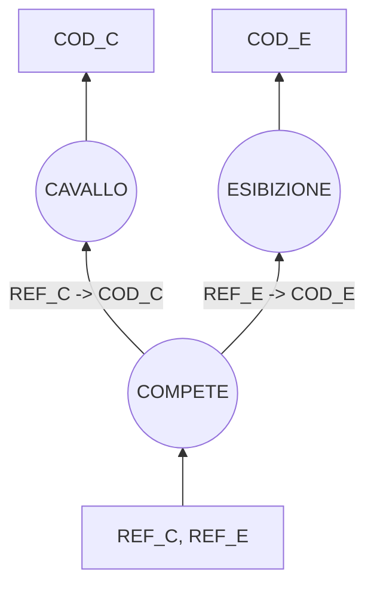

# Esercitazione [04/04/2023]

## Relazioni

<text style=color:red>CAVALLO</text>(**COD_C**, NOME_C, COGNOME_FANTINO, RAZZA, COLORE, ETA)
<text style=color:blue>ESIBIZIONE</text>(**COD_E**, NOME_E, ANNO, CITTA, NAZIONE, SOCIETA_ORGANIZZATRICE)
<text style=color:lightgreen>COMPETE</text>(**REF_C**, **REF_E**, DATA)

<text style=color:red>1.</text> SELEZIONARE LE DATE NELLE QUALI HA GAREGGIATO UN CAVALLO CAVALCATO DAL FANTINO
‘DETTORI’ DI ANNI 6 E DI RAZZA ‘PUROSANGUE’;

PROJCO.DATA (SELCA.COGNOME_FANTINO = 'DETTORI' & CA.ETA = 6 & CA.RAZZA = 'PUROSANGUE' (CA JOINCA.COD_C = CO.COD_C CO))

<text style=color:red>2.</text> SELEZIONARE TUTTI I DATI DEI CAVALLI CAVALCATI DAL FANTINO ‘RISPOLI’ CHE NON HANNO MAI
GAREGGIATO NEL 2020;

PROJCA.COD_C, CA_NOME_C, CA.COGNOME_FANTINO, CA.RAZZA, CA.COLORE, CA.ETA (SELCA.COGNOME_FANTINO = 'RISPOLI' (CA JOINCA.COD_C = CO.REF_C CO) - SELCO.DATA > '01/01/2022' & CO.DATA < '31/12/2022' (CA JOINCA.COD_C = CO.REF_C CO))

<text style=color:red>3.</text> SELEZIONARE TUTTI I DATI DEI CAVALLI CHE NON HANNO MAI GAREGGIATO INSIEME AD UN
CAVALLO DEL FANTINO ‘ERCEVOGIC’;

PROJCA.COD_C, CA.NOME_C (CA) - RENCOD_C <- CA1.COD_C1, NOME_C <- CA1.NOME_C1 (PROJCA1.COD_C1, CA1.NOME_C1 (SELCA2.COGNOME_FANTINO2 = 'ERCEGOVIC' ((CA1 JOINCA1.COD_C1 = CO1.REF_C1 CO1) JOINCO1.REF_E1 = CO2.REF_E2 (CA2 JOINCA2.COD_C2 = CO2.REF_C2 CO2))))
